# Tennis For All

The purpose of this website is to encourage people of all ages, skills and standards to consider taking up tennis. It introduces tennis as an accessible option for everyone. It shows you don’t have to be a pro with years of coaching to be able to enjoy this game. The social aspect of the events is clearly emphasized as well. 

The site is targeted towards people who might not be very physically active and who are lacking social connection. 

Tennis For All is useful for all people in a particular neighbourhood who want to meet new friends and be more fit by providing information about different game options available for men, women and children, but also for those who want to play tennis at a more competitive level.

<a href="https://lucia2007.github.io/tennis-for-all/index.html" target="_blank" rel="noopener">Let's play!</a>

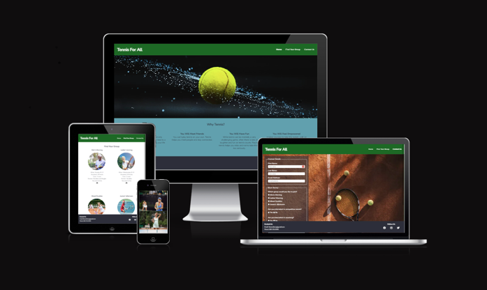

#Contents
* [**User Experience UX**](<#user-experience-ux>)
    * [Wireframes](<#wireframes>)
    * [Site Structure](<#site-structure>)
    * [Design Choices](<#design-choices>)
    *  [Typography](<#typography>)
    *  [Colour Scheme](<#color-scheme>)
* [**Features**](<#features>)
    * [**Tennis For All**](<#navigation-menu>)
         * [Navigation menu](<#navigation-menu>)
         * [Hero Image](<hero-image>)
         * [Gallery](<#gallery>)
         * [Footer](<#footer>)

##Wireframes

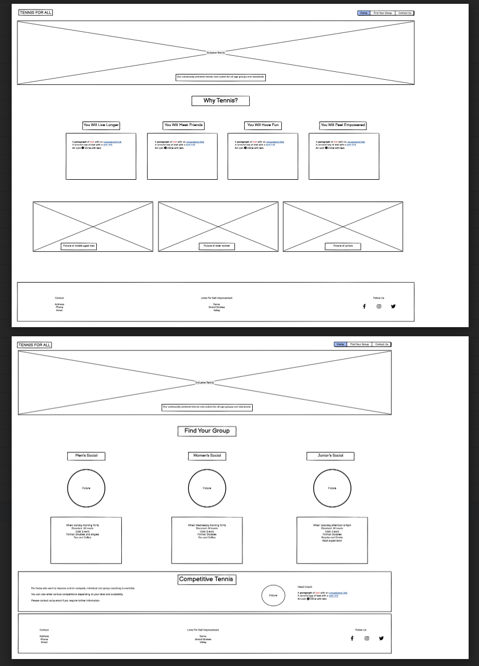

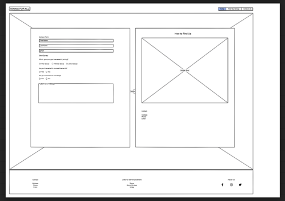

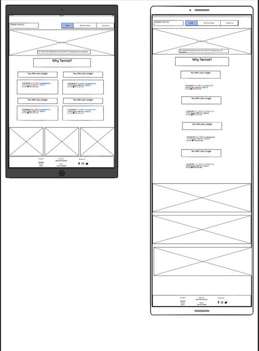

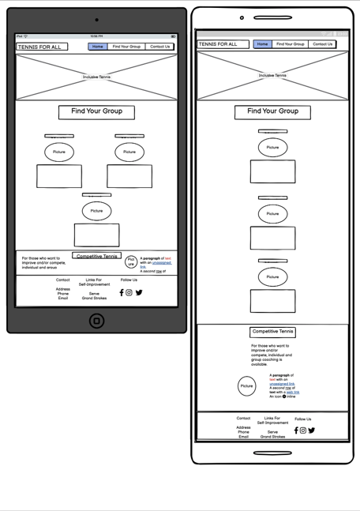

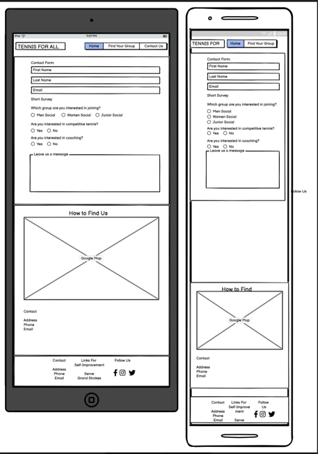

The wireframes were created in [Balsamiq](https://balsamiq.com). Originally, I started with focusing on the desktop version. After encouragement from a tutor, I changed my approach to mobile first. This approach later led to simpler media queries.

On the second page I added a fourth tennis group to make the page more even for larger screens. 

I left out pictures in the Improvement section for larger screens as they were disruptive having been placed right under another set of pictures in the Find Your Group section.

After consultation with my mentor, I additionaly created a separate section for the self-improvement tips, instead of placing them in the footer. 

I also left out the "How to Find Us" section, as it was bringing focus to a particular club, whereas the purpose of the site is to arouse interest in tennis itself, the venue being secondary. 

Lastly, I added an extra Thank you page where a user is taken after filling in the form to create a more pleasant user experience.

[Back to top](<#contents>)

## Site Structure

Tennis For All website has three pages. All pages can be easily accessed through the navigation menu in the header section. The [Landing page](index.html), the [Find Your Group](group.html) page and finally the [Contact Us](contact.html) page.

[Back to top](<#contents>)

## Design Choices

 * ### Typography
      The chosen fonts were downloaded from [Google Fonts](https://fonts.google.com/). "Albert Sans", weight 300, is used for the body and for the headings it is 'Nunito Sans', both with a fall back to sans-serif. Both fonts create an inviting, non-intimidating feeling and are easily legible.

 * ### Color Scheme
      The chosen color scheme reflects the colors most often seen on tennis courts: green, orange, blue. The complementary colors were chosen using [Color pallete generator](coolors.co).

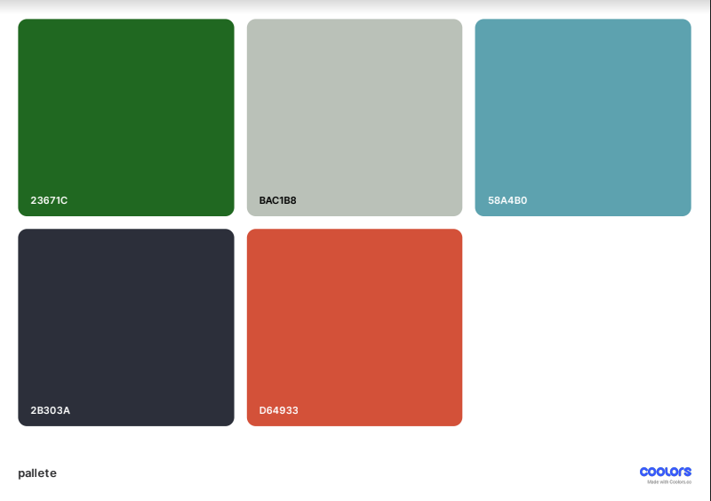

[Back to top](<#contents>)

# Features

<!-- Tennis For All is meant to be inviting, straightforward and easy to navigate. Navigation bar makes finding the necessary information simple. All hypertext links open in a new page. The contact form invites the clients to get in touch and get involved. -->
## The Landing Page

### Navigation Bar

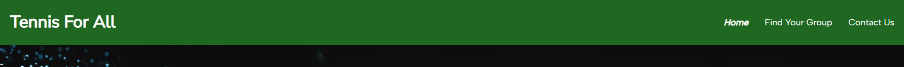

* Navigation Bar is present on all three pages to make navigation of the website easy and quick. It containes links to Home, Find Your Group and Contact page. Its design is consistent and identical on all of the pages. This feature enables the users to navigate from page to page without having to use the "back" button of the browser.

* The main logo is also clickable and takes the user back to the home page.

[Back to top](<#contents>)

### The Hero Image

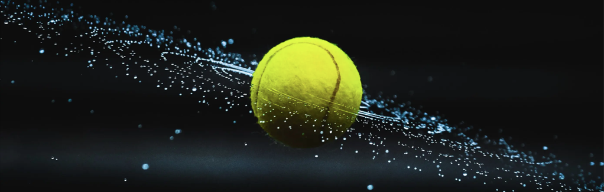

The landing page includes a large dynamic image of a tennis ball which catches the eye of the user.

[Back to top](<#contents>)

### The Reasons Section

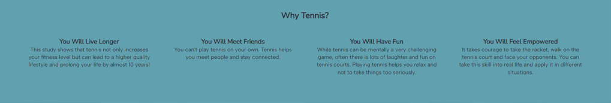

This sections introduces four reasons for taking up tennis, including a hypertext link to a study which shows that playing tennis can prolong life by 10 years, far more than other sports. Its goal is to get people interested and help them consider giving tennis a try.

[Back to top](<#contents>)

### The Gallery Section

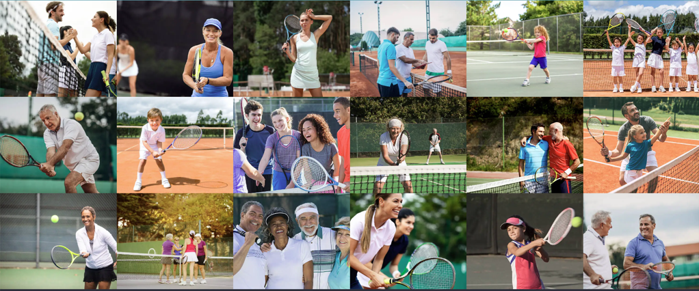

The main purpose of this section is to show people of different age, genders and economic status playing tennis, having fun and connection while doing it. This section will help users find courage to give tennis a try.

[Back to top](<#contents>)

### The Footer

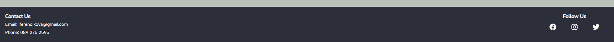

The Footer section is consistent in design in all pages. It includes email address and phone contact of the person responsible for the social tennis games which take place in the neighbourhood club. There are also links to a fictional social media profile including Facebook, Instagram and Twitter. The email includes a hypertext link to make it easy to get connected by email. The social media links open in a new tab. 

# Find Your Group Page

## Groups

This part of the page introduced different options which are available. It provides details about the meet up times and place of each of the groups, gives details about standards and format of the game. Cost and refreshment information is also included.
<!-- include an image -->

## Competitive tennis

This section focuses on those players who would like to play on a more competitive level or would be interested in taking up coaching. A link to the neighbourhood club which offers these options is included.
<!-- include an image -->

# Contact Us

## Form
A form is available for those who would like to get in touch, need further information or are interested in more competitive tennis or coaching. All elements, like name, email address etc. are required.
<!-- include an image -->

# Features left to implement
<!-- 

For some/all of your features, you may choose to reference the specific project files that implement them.

In addition, you may also use this section to discuss plans for additional features to be implemented in the future:

Features Left to Implement
Another feature idea  -->

# Testing
<!-- Testing 
In this section, you need to convince the assessor that you have conducted enough testing to legitimately believe that the site works well. Essentially, in this part you will want to go over all of your project’s features and ensure that they all work as intended, with the project providing an easy and straightforward way for the users to achieve their goals.

In addition, you should mention in this section how your project looks and works on different browsers and screen sizes.

You should also mention in this section any interesting bugs or problems you discovered during your testing, even if you haven't addressed them yet.

If this section grows too long, you may want to split it off into a separate file and link to it from here.

Validator Testing
HTML
No errors were returned when passing through the official W3C validator
CSS
No errors were found when passing through the official (Jigsaw) validator
Unfixed Bugs

You will need to mention unfixed bugs and why they were not fixed. This section should include shortcomings of the frameworks or technologies used. Although time can be a big variable to consider, paucity of time and difficulty understanding implementation is not a valid reason to leave bugs unfixed. -->

# Deployment

<!-- This section should describe the process you went through to deploy the project to a hosting platform (e.g. GitHub) 

The site was deployed to GitHub pages. The steps to deploy are as follows:
In the GitHub repository, navigate to the Settings tab
From the source section drop-down menu, select the Master Branch
Once the master branch has been selected, the page will be automatically refreshed with a detailed ribbon display to indicate the successful deployment.
The live link can be found here - https://code-institute-org.github.io/love-running-2.0/index.html  -->

# Credits

<!-- In this section you need to reference where you got your content, media and extra help from. It is common practice to use code from other repositories and tutorials, however, it is important to be very specific about these sources to avoid plagiarism.

You can break the credits section up into Content and Media, depending on what you have included in your project.

Content
The text for the Home page was taken from Wikipedia Article A
Instructions on how to implement form validation on the Sign Up page was taken from Specific YouTube Tutorial
The icons in the footer were taken from Font Awesome

Media
The photos used on the home and sign up page are from This Open Source site
The images used for the gallery page were taken from this other open source site
Congratulations on completing your Readme, you have made another big stride in the direction of being a developer!

Other General Project Advice
Below you will find a couple of extra tips that may be helpful when completing your project. Remember that each of these projects will become part of your final portfolio so it’s important to allow enough time to showcase your best work!

One of the most basic elements of keeping a healthy commit history is with the commit message. When getting started with your project, read through this article by Chris Beams on How to Write a Git Commit Message

Make sure to keep the messages in the imperative mood
When naming the files in your project directory, make sure to consider meaningful naming of files, point to specific names and sections of content.

For example, instead of naming an image used ‘image1.png’ consider naming it ‘landing_page_img.png’. This will ensure that there are clear file paths kept.
Do some extra research on good and bad coding practices, there are a handful of useful articles to read, consider reviewing the following list when getting started:

Writing Your Best Code
HTML & CSS Coding Best Practices
Google HTML/CSS Style Guide
Getting started with your Portfolio Projects can be daunting, planning your project can make it a lot easier to tackle, take small steps to reach the final outcome and enjoy the process! -->

[def]: assests/readme/images/mockup_p1_p2_desktop.png