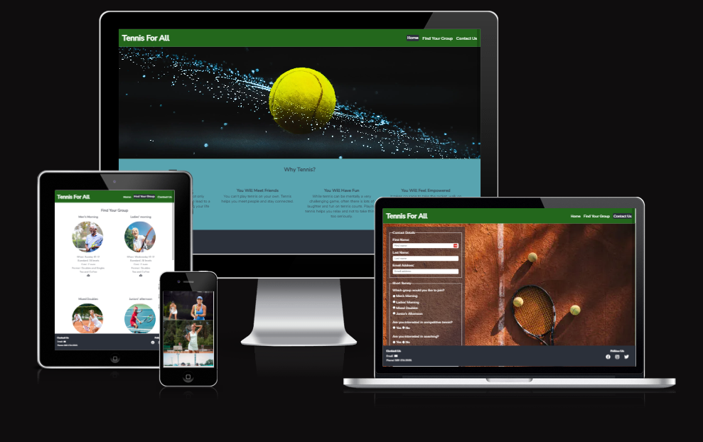
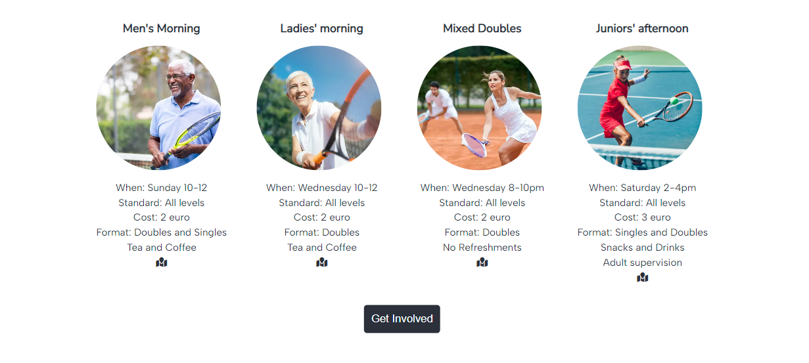
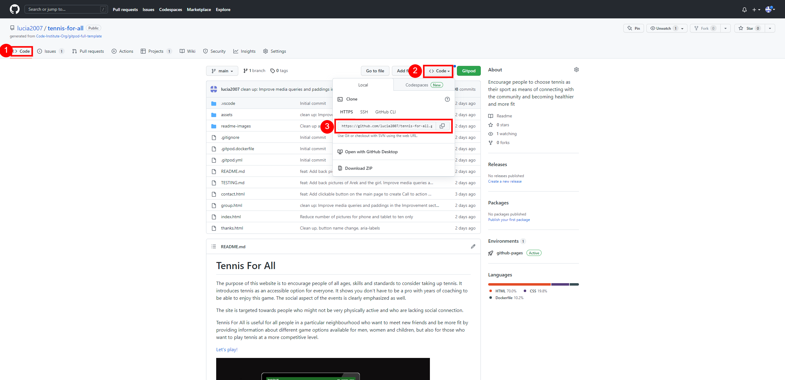

# Tennis For All

The purpose of this website is to encourage people of all ages, skills and standards to consider taking up tennis. It introduces tennis as an accessible option for everyone. It shows you don’t have to be a pro with years of coaching to be able to enjoy this game. The social aspect of the events is clearly emphasized as well. 

The site is targeted towards people who might not be very physically active and who are lacking social connection. 

Tennis For All is useful for all people in a particular neighbourhood who want to meet new friends and be more fit by providing information about different game options available for men, women and children, but also for those who want to play tennis at a more competitive level.

<a href="https://lucia2007.github.io/tennis-for-all/index.html" target="_blank" rel="noopener">Let's play!</a>

# Contents

* [**User Experience**](#user-experience)
    * [Wireframes](#wireframes)
    * [Site Structure](#site-structure)
    * [Design Choices](#design-choices)
    *  [Typography](#typography)
    *  [Color Scheme](#color-scheme)
* [**Features**](#features)
    * [**Home Page**](#home-page)
         * [Navigation menu](#navigation-menu)
         * [Hero Image](#hero-image)
         * [Reasons Section](#reasons-section)
         * [Gallery](#gallery)
         * [Footer](#footer)
    * [**Find Your Group Page**](#find-your-group-page)
         * [Available Groups](#available-groups)
         * [Improvement Section](#improvement-section)
    * [**Contact Us Page**](#contact-us-page)
         * [Contact Form and a Short Survey](#contact-form-and-a-short-survey)
    * [**Thank You Page**](#thank-you-page)
         * [Thank you message](#thank-you-message)   
    * [**Future Features**](<#future-features>)
* [**Technologies Used**](<#technologies-used>)
* [**Testing**](<#testing>)
* [**Deployment**](<#deployment>)
* [**Credits**](<#credits>)
    * [**Content**](<#content>)
    * [**Media**](<#media>)
*  [**Acknowledgements**](<#acknowledgements>)  

# User Experience

## Wireframes

The wireframes were created in [Balsamiq](https://balsamiq.com). Originally, I started with focusing on the desktop version. After encouragement from a tutor, I changed my approach to mobile first. This approach later led to simpler media queries.

On the second page I added a fourth tennis group to make the page more even for larger screens. 

I left out pictures in the Improvement section for larger screens as they were disruptive having been placed right under another set of pictures in the Find Your Group section.

After consultation with my mentor, I additionaly created a separate section for the self-improvement tips, instead of placing them in the footer. 

I also left out the "How to Find Us" section, as it was bringing focus to a particular club, whereas the purpose of the site is to arouse interest in tennis itself, the venue being secondary. 

Lastly, I added an extra Thank you page where a user is taken after filling in the form to create a more pleasant user experience.

[Desktop wireframe page 1 and page 2](readme-images/mockup_p1_p2_desktop.png)

[Desktop wireframe page 3](readme-images/mockup_p3_desktop.png)

[Tablet and mobile wireframe page 1](readme-images/mockup_p1_tablet_mobile.png)

[Tablet and mobile wireframe page 2](readme-images/mockup_p2_tablet_mobile.png)

[Tablet and mobile wireframe page 3](readme-images/mockup_p3_tablet_mobile.png)

[Back to top](#contents)

## Site Structure

Tennis For All website has three pages. All pages can be easily accessed through the navigation menu in the header section. The [Home page](index.html), the [Find Your Group](group.html) page and finally the [Contact Us](contact.html) page.

[Back to top](#contents)

## Design Choices

 * ### Typography
      The chosen fonts were downloaded from [Google Fonts](https://fonts.google.com/). "Albert Sans", weight 300, is used for the body and for the headings it is 'Nunito Sans', both with a fall back to sans-serif. Both fonts create an inviting, non-intimidating feeling and are easily legible.

 * ### Color Scheme
      The chosen color scheme reflects the colors most often seen on tennis courts: green, orange, blue. The complementary colors were chosen using [Color pallete generator](coolors.co).

[Back to top](#contents)

# Features

<!-- Tennis For All is meant to be inviting, straightforward and easy to navigate. Navigation bar makes finding the necessary information simple. All hypertext links open in a new page. The contact form invites the clients to get in touch and get involved. -->

## Home Page

### Navigation Menu

* Navigation Bar is present on all three pages to make navigation of the website easy and quick. It containes links to Home, Find Your Group and Contact page. Its design is consistent and identical on all of the pages. This feature enables the users to navigate from page to page without having to use the "back" button of the browser.

* The main logo is also clickable and takes the user back to the home page.

[Back to top](#contents)

### Hero Image

The landing page includes a large dynamic image of a tennis ball which catches the eye of the user.

[Back to top](#contents)

### Reasons Section

This sections introduces four reasons for taking up tennis, including a hypertext link to a study which shows that playing tennis can prolong life by 10 years, far more than other sports. Its goal is to get people interested and help them consider giving tennis a try.

[Back to top](#contents)

### Gallery

The main purpose of this section is to show people of different age, genders and economic status playing tennis, having fun and connection while doing it. This section will help users find courage to give tennis a try.

[Back to top](#contents)

### Footer

The Footer section is consistent in design on all pages. It includes email address and phone contact of the person responsible for the social tennis games which take place in the neighbourhood club. There are also links to a fictional social media profile including Facebook, Instagram and Twitter. The email includes a hypertext link to make it easy to get connected by email. The social media links open in a new tab. 

[Back to top](#contents)

## Find Your Group Page

### Available Groups 

This part of the page introduces different options which are available for interested clients. It provides details about the meet up times and place of each of the available groups, gives details about standards and format of the game. Cost and refreshment information is also included.

[Back to top](#contents)

### Improvement Section

This section focuses on those players who would like to improve their game or play on a more competitive level. Links to educational videos in five major areas (grand strokes, serve, volley, footwork, tactics) are provided.  Information about coaching possibilies is presented for those clients who might be interested in taking up coaching. A link to the location of the neighbourhood club which offers these options is included.

[Back to top](#contents)

## Contact Us Page

### Contact Form and A Short Survey

A form is available for those who would like to get in touch, need further information or are interested in more competitive tennis or coaching. All elements, like name, email address etc. are required. The user is to provide his contact details including his/her name and email address. A short survey asks about group preference and about interest in coaching and/or competitive tennis.

[Back to top](#contents)

## Thank You Page

### Thank You Message

A thank you message is displayed after filling in the contact form and the survey. The form is validated. The usual navigation links are available for the user to be able to return to the page of interest.

[Back to top](#contents)

### Future Features 

* Adding a back to top button would enhance the user's experience as he/she wouldn't have to scroll back all the way to the top.
* I might consider changing the hero image for an image that would not be so dark in the future.

[Back to top](#contents)

# Technologies Used

* [HTML5](https://html.spec.whatwg.org/) - provided the structure and content for the website
* [CSS](https://www.w3.org/Style/CSS/Overview.en.html) - enabled applying own styles and design
* [Balsamiq](https://balsamiq.com/wireframes/) - used for creating the wireframes
* [Gitpod](https://www.gitpod.io/#get-started) - used for deploying the website
* [Github](https://github.com/) - used for hosting and editing the website

[Back to top](#contents)

# Testing

For detailed results of all the tests conducted, please refer to this [_file_](TESTING.md).

[Back to top](#contents)

# Deployment

## **Project Deployment**

The site was deployed to GitHub pages. In order to deploy, the following steps were taken:
  1. Navigate to the **Settings** tab in the GitHub repository.
  2. When in **Settings**, navigate to the **Pages** tab below the middle of the list on the left hand side.
  3. From the **Branch** drop-down menu select the option **main**, then click **save**.
  4. After the main branch has been selected and confirmed, the page will be automatically refreshed. The refresh might take several minutes. A detailed message will appear at the top of the page indicating the successful deployment. The message will include a link to the deployed site.

The link to the the live site can be found here - https://lucia2007.github.io/tennis-for-all/

[Back to top](#contents)  

## **To fork the repository on GitHub**
A copy of the GitHub Repository can be made by forking the GitHub account. This copy can be viewed and changed without affecting the original repository. Take the following steps to fork the repository:

1. Log in to **GitHub** and locate the [repository](https://github.com/lucia2007/tennis-for-all).
2. On the top right hand side of the page is a button called **'Fork'**. Click on the button to create a copy of the original repository in your GitHub Account.

[Back to top](#contents)

## **To create a local clone of a project**
Take the following steps to create a clone of a project:

1. Click on the **Code** button in the left top corner.
2. Next to the green **GitPod** button, click on **Code** drop-down menu. 
2. In the **HTTPS** section, click on the clipboard icon to copy the displayed URL.
3. In your IDE of choice, open **Git Bash**.
4. Change the current working directory to the location where you want the cloned directory to be made.
5. Type **git clone**, and then paste the URL copied from GitHub.
6. Press **enter** and the local clone will be created.

[Back to top](#contents)

# Credits

## Content

* The overall inspiration came from my local [Tennis Club](https://shankilltennisclub.com/) which is extremely welcoming and accomodating of new players. Visiting this club significantly helped our family with making friends, having fun, keeping fit and assimilating in the new country.
* The inspiration for the navigation and the form came from *Love Running Project*.
* The styling of Find Your Group section was inspired by [Czechitas](https://czechitas.cz).
* The fonts were downloaded from [Google Fonts](https://fonts.google.com/).
* The location of the local tennis club is taken from [Google Maps](https://www.google.com/maps).
* The Find Your Group page content was partly taken from this [site](https://shankilltennisclub.com/).
* The color pallete was downloaded from [coolors](https://coolors.co).
* The icons were found at [Font Awesome](https://fontawesome.com/).
* [Balsamiq](https://balsamiq.com/wireframes/) was used to create the wireframes.
* The framework for the readme file was taken from [Wawas Wood](https://github.com/EwanColquhoun/wawaswoods/blob/master/README.md).

## Media

* The images were downloaded from [Unsplash](https://unsplash.com/), [iStock](https://www.istockphoto.com/) and [Shankill Tennis Club](https://shankilltennisclub.com/).
* The instructional tennis videos were found on [YouTube](https://youtube.com).
* The photos were compressed using the [Squoosh app](https://squoosh.app//).

## Acknowledgement
* Extra help and guidance was received from my mentor Precious Ijege, from tutors and fellow colleagues from the Code Institute. Many an insight was received from my friend Aoife. 
* I received help from tutors with my images (object fit: cover property and the use of grid helped), with navigation bar which was "jumping" and becoming bigger when hovered on and with my footer overflowing due to a set size of one of the elements.
* To make the buttons on Home and Find Your Group page clickable, I used the [solution #1](https://testbook.com/web-development/how-to-create-an-html-button-that-acts-like-a-link) from the indicated website (onclick="window.location.href = 'group.html';").
* A tutorial for creating a sticky footer was found [here](https://www.youtube.com/watch?v=VSIB9zPYu4w).
* [Kevin Powell's videos](https://www.youtube.com/watch?v=u044iM9xsWU) were instrumental in the use of flexbox.

Thank you all for your support and encouragement.

