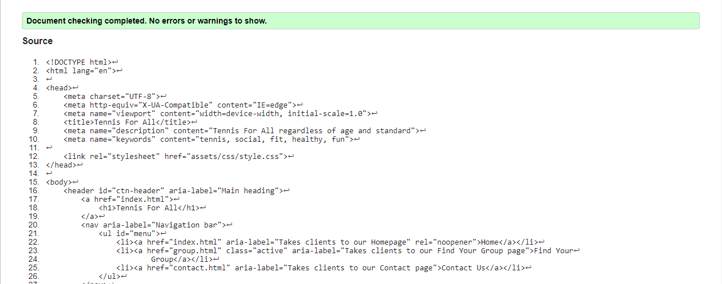
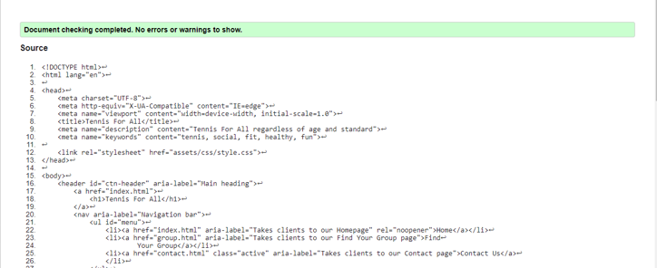
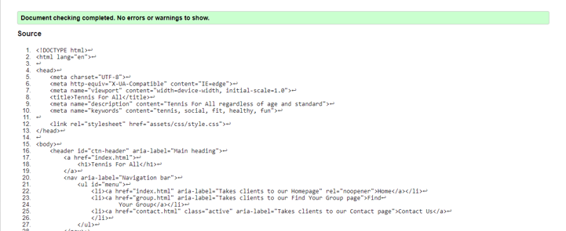
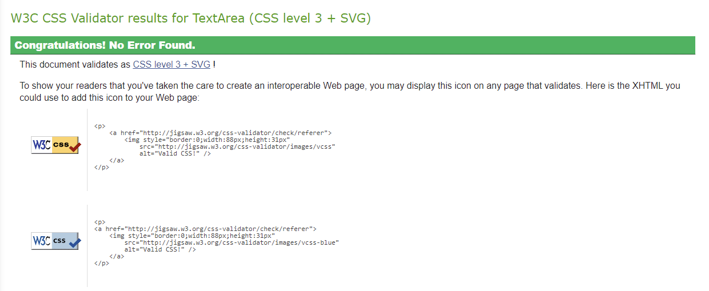
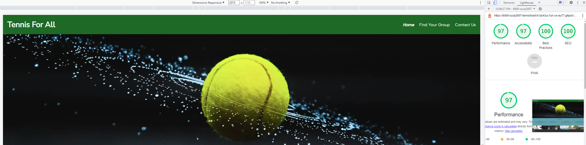
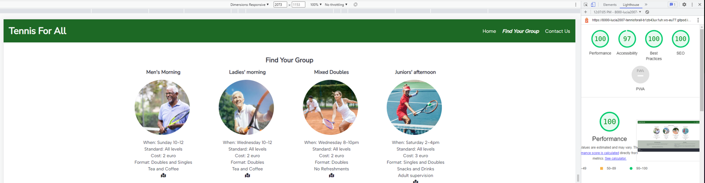
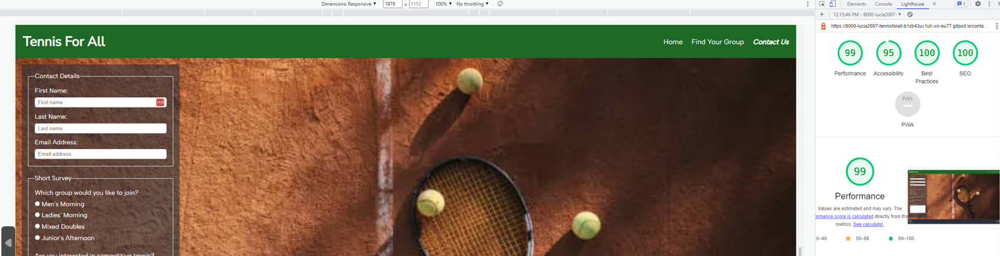
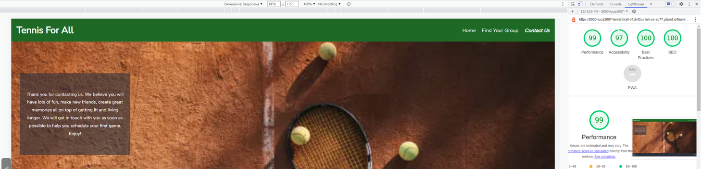

# Testing

## Code Validation

The [Tennis For All](https://lucia2007.github.io/tennis-for-all/index.html) webpage was thouroughly tested. HTML code was reviewed in the [W3C HTML Validator](https://validator.w3.org). The CSS code was validated in the [W3C CSS Validator](https://jigsaw.w3.org/css-validator/). There were a few minor errors found regarding incorrect semantic use of section and span (details below). All mistakes were corrected and both HTML and CSS files currently have no errors.

The results of HTML validation of each of the pages are as follows:

* Home Page

* Find Your Group Page

* Contact Us Page

* Thank You Page

The CSS Validator results are below:

## Browser Compatibility

The website was tested on the following browsers: Google Chrome, Safari, Microsoft Edge and Mozilla Firefox. There were no errors discovered in the functionality of the site or the individual features.

## Responsiveness Test

Testing of responsive design was carried out manually by utilizing [Google Chrome DevTools](https://developer.chrome.com/docs/devtools) and [Responsive Design Checker](https://www.responsivedesignchecker.com/).

|        | S Galaxy 5 | iPhone 6/6S/7| iPhone 5 | iPad Mini | iPad Pro | Display <1200px | Display >1200px |
|--------|------------|--------------|----------|-----------|----------|-----------------|-----------------|
| Render | pass       | pass         | pass     | pass      | pass     | pass            | pass            |
| Images | pass       | pass         | pass     | pass      | pass     | pass            | pass            |
| Links  | pass       | pass         | pass     | pass      | pass     | pass            | pass            |

## Known Bugs

* When validating the code, a few erros came up especially regarding the use of section and span elements. 
    ** I was using section elements without a header element and that was not allowed. I changed most of the section elements without a header into a div element. On the Contact Us page, I included a header with display none, as I did not want to change the look of the page, but had wanted to use the semantically more appropriate element. 
    ** Also a use of paragraph element within the span was not allowed. I changed the span element into a div and that solved the problem.
    ** I was mising an <li> element around an anchor element for the map icon on the Find Your Group page.
* One of my early erros was that I had applied padding to my anchor element when hovered on, instead of applying it in a static position. This was causing the navbar items to be distorted and move/jump when hovered on. This was fixed by adding padding to the anchor element when static, rather than when hovered on. I also had to use outline rather then border for styling the navbar, as this was not adding to the size of the box.
* In several cases I had to change <h1> heading to <h2> as it made more semantic sense.
* When I deployed my site for the first time, my images did not show. This was due to a mistake in the relative path, where I had used two dots (../) instead of just one dot (./).

## Additional Testing

### Lighthouse
The application was also tested using [Google Lighthouse](https://developers.google.com/web/tools/lighthouse) in Chrome Developer Tools. The following aspects were tested:

* Performance - reveals how the site performs during loading
* Accessibility - shows if the site if accessible for all users and suggests ways to improve it
* Best Practices - indicates if the site conforms to industry best practices
* SEO - Search Engine Optimisation - shows if the site is optimised for search engine result rankings

### Results from Lighthouse 

* Home Page

* Find Your Group Page

* Contact Us Page

* Thank You Page

* Originally, my site results were poor on performance and on accessibility. I compressed all images using [the Squoosh app](https://squoosh.app/) and it improved the peformance significantly. As for accessibility, I added extra aria-labels especially for the form which increased the score sufficiently.